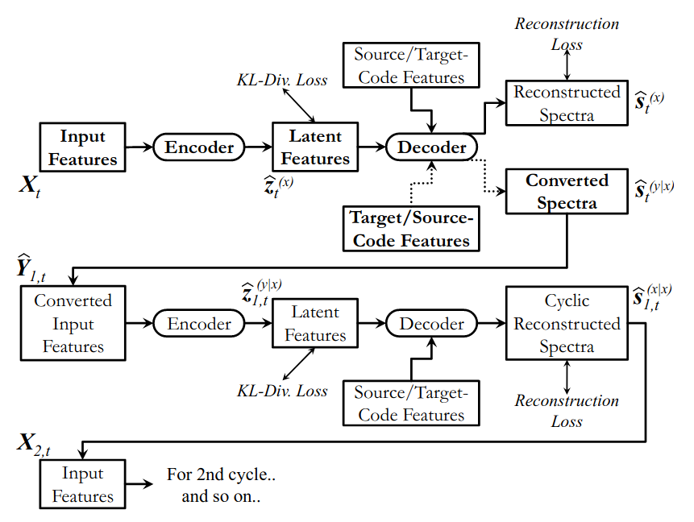
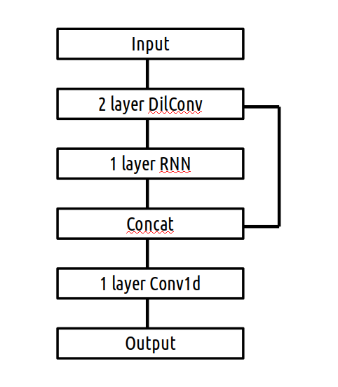
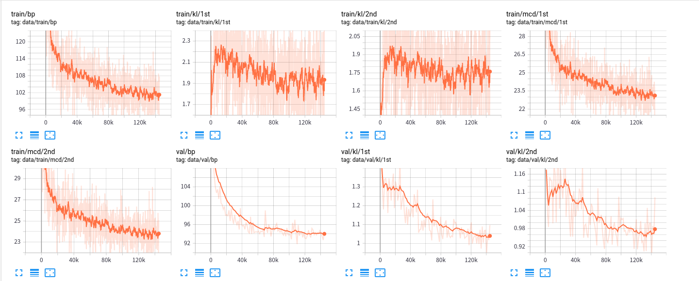
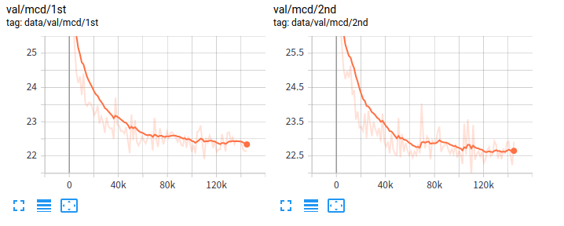
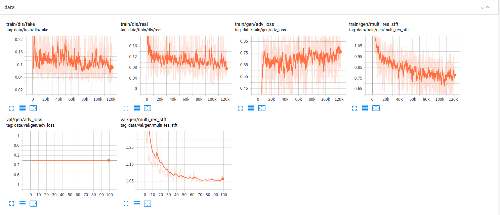

# CycleVAE-VC implementation with Pytorch

This repository provides UNOFFICIAL [CycleVAE-VC](https://arxiv.org/abs/1907.10185) implementations with Pytorch.

You can combine your own vocoder to get great converted speech!!



> Source of the figure: https://arxiv.org/pdf/1907.10185.pdf

The goal of this repository is to provide VC model trained with completely non-parallel data.
Also this repository is to provide many-to-many conversion model.

I modified the model from @patrickltobing 's implementation as below.
In the original model, AR structure is used for ConvRnn network. However, it takes quite a long time to train with that model. So I used RNN-based model to train faster.




## What's new

- 2020/06/11	Support training script of Parallel-Wave-GAN.
- 2020/06/02	Support one-to-one conversion model.

## Vocoder branch
- This branch supports vocoder training and decoing. In this branch, I support [PWG (ParallelWaveGAN)](https://github.com/kan-bayashi/ParallelWaveGAN) as a default neural vocoder.

## Requirements

This repository is tested on Ubuntu 19.10 with a RTX2080ti with the following environment.

- Python 3.7+
- Cuda10.2
- CuDNN 7+


## Setup

You can setup this repository with the following commands.

```
$ cd tools
$ make
```

Please check if the `venv` directory is successfully located under the tools directory.


## Usage

Before training the model, be sure to locate your wav files under specific directory.
I assume that the structure of the wav directory is:
```
wav
├── train
│   ├── jvs001
│   └── jvs002
└── val
    ├── jvs001
    └── jvs002
```

### Step0: path

- This script is not designed for servers, which uses `slurm` .

- If you are using `slurm` or you have some GPUs, then you have to add environment variables in `path.sh` 

- To set environment variables and activate virtual environment, run

  ```
  . path.sh
  ```

  

### Step1: set min/max f0

- Run the next command to generate figures

  ```
  . run.sh --stage 0
  ```

  and the figures will generated into `./figure` directory.

- If you don't have speaker config file in `./config/speaker` , then you have to do the following

  1.  Copy `./config/speaker/default.conf`  to `./config/speaker/<spk_name>.conf`

  2. Set speaker-dependent variables there.

     The structure of the config file is:

     ```
     <minf0>
     <maxf0>
     <npow>
     ```


### Step2: Feature extract and training model.

- Run the next command to extract features and train the model.

  ```
  . run.sh --stage 12
  ```

  - stage1: Feature Extract

  - Stage2: Training

    

  **Flags in training stage** 

  - conf_path : Path to the training config file. Default: `./config/vc.conf`
  - model_name : Name of the saved model. Model name will be  `<model_name>.<num_iter>.pt` .
  - log_name : Logging directory to save events files from tensorboard


### Step3: Convert voice

- Run the next command to convert voice.

  ```
  . run.sh --stage 3
  ```
  

  **Flags in conversion stage** 

  - test_dir : Directory to save source wav files.
  - exp_dir : Directory to save converted wav files.
  - checkpoint : Path to the trained model.
  - log_name : Name of the log file.


## Results

- training steps for CycleVAE_VC

  

  

- sounds

  - demo wav files are acquired from https://voice-statistics.github.io/
  
- You can find converted wav files in `./for_readme/wav/cvae` 
  
- training steps for ParallelWaveGAN

  
  
- You can find converted wav files in `./for_readme/wav/vocoder`


## Features to be implemented in the future
- [ ] Support gin-config
   

## References

- [patrickltobing/cyclevae-vc](https://github.com/patrickltobing/cyclevae-vc)

- [k2kobayashi/sprocket](https://github.com/k2kobayashi/sprocket)
- [nlpyang/PreSumm](https://github.com/nlpyang/PreSumm)
- [Non-Parallel Voice Conversion with Cyclic Variational Autoencoder](https://arxiv.org/abs/1907.10185)
- [声優統計コーパス](https://voice-statistics.github.io/)
- [ParallelWaveGAN](https://github.com/kan-bayashi/ParallelWaveGAN)


## Acknowledgement

The author would like to thank [Patrick Lumban Tobing](https://arxiv.org/search/eess?searchtype=author&query=Tobing%2C+P+L) for his repository.


## Author

Someki Masao ([@Masao-Someki](https://github.com/Masao-Someki))

e-mail : `masao.someki@outlook.jp`


